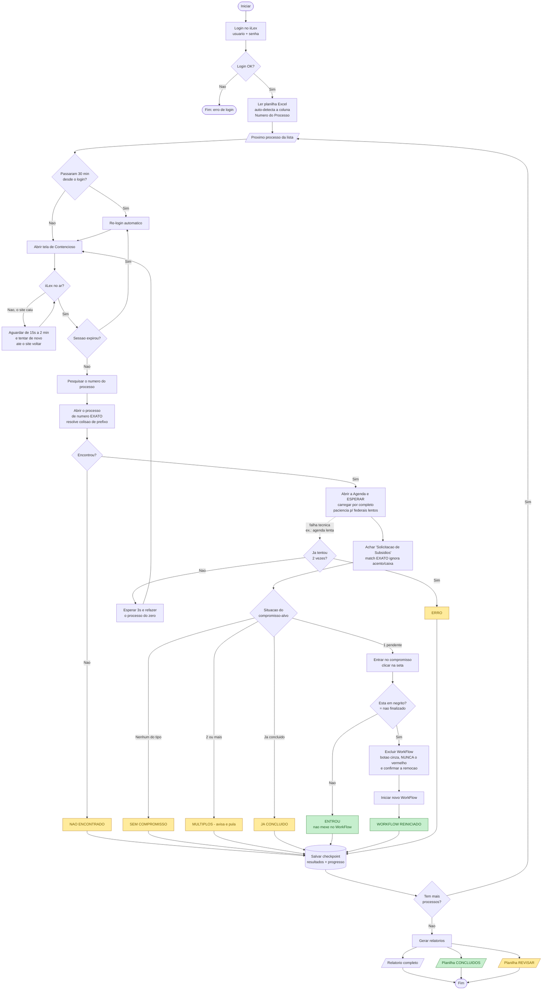

# Fluxograma — Reiniciador de Workflow - iiLex (RPA)

Fluxo da automação, do login até a geração dos relatórios.

## Legenda dos resultados

| Resultado | Significado | Vai para |
|---|---|---|
| 🟢 **WORKFLOW REINICIADO** | Entrou no compromisso e reiniciou o WorkFlow | Concluídos |
| 🟢 **ENTROU** | Entrou, mas o compromisso já estava finalizado (não mexe no WF) | Concluídos |
| 🟡 **SEM COMPROMISSO** | O processo não tem o compromisso-alvo | Revisar |
| 🟡 **JÁ CONCLUÍDO** | O compromisso-alvo já havia sido concluído | Revisar |
| 🟡 **MÚLTIPLOS** | 2+ compromissos do mesmo tipo (avisa e pula) | Revisar |
| 🟡 **NÃO ENCONTRADO** | O processo não foi localizado no iiLex | Revisar |
| 🟡 **ERRO** | Falha técnica que **persistiu mesmo após re-tentar** | Revisar |

## Proteções para rodadas longas
- **Re-login proativo** a cada 30 min (a sessão nunca expira)
- **Re-login reativo** se a sessão cair mesmo assim
- **Resiliência a quedas**: se o iiLex sair do ar, espera (15s → até 2 min) e tenta até voltar
- **Paciência ao carregar**: espera a Agenda carregar por completo antes de decidir (processos federais/TRF demoram mais)
- **Auto-retry**: erro técnico transitório (ex.: agenda não carregou a tempo) é re-tentado **até 2x** antes de virar ERRO
- **Checkpoint**: dá para parar e retomar de onde parou — **preservando os resultados já obtidos** (contadores e erros não se perdem)

## Segurança (regras do negócio)
- Só reinicia o WorkFlow se o compromisso estiver **em negrito** (= não finalizado)
- Usa **somente** o botão "Excluir" cinza do submódulo — **nunca** o "Excluir" vermelho (que apagaria o compromisso inteiro)
- Match **EXATO** do tipo: "Solicitação de Subsídios - CEF" **não** é confundido com "Solicitação de Subsídios"
